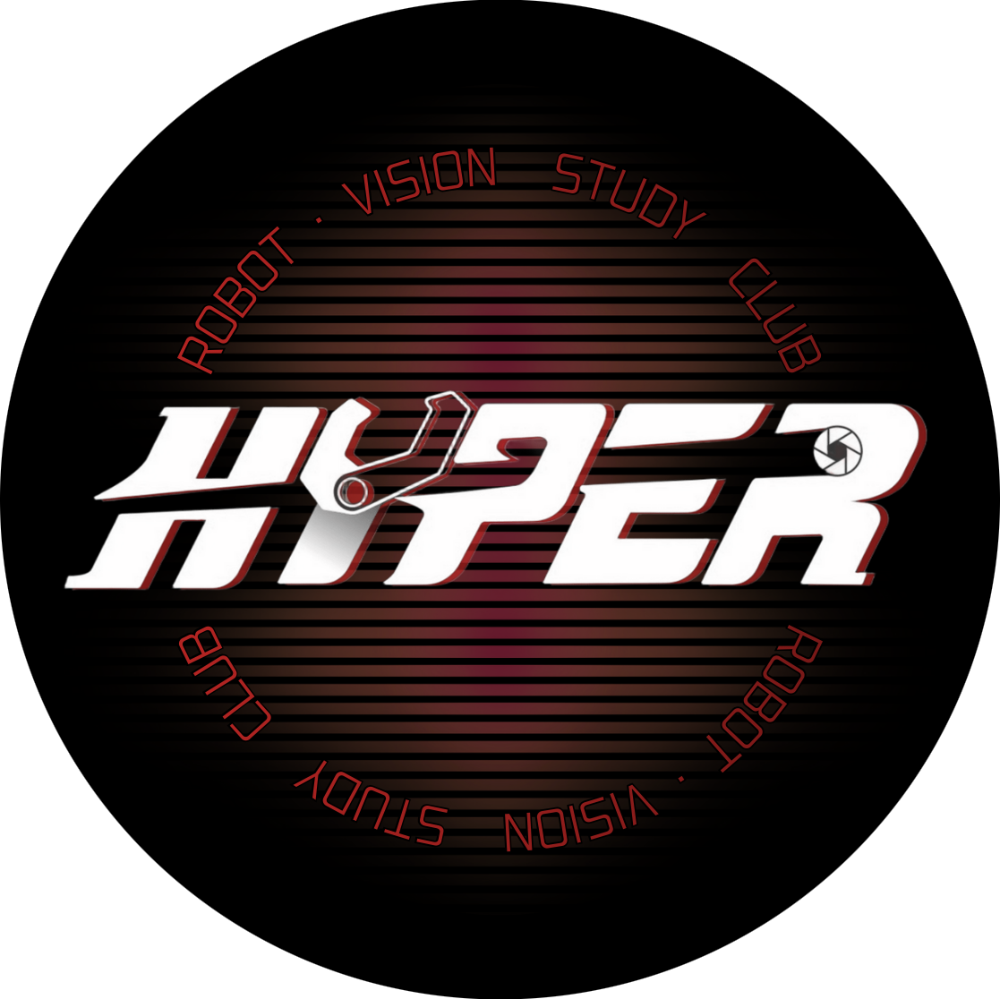

<h1>
Jaewon Heo 
  
</h1>

  <e>
    Junior student at <a href="https://www.khu.ac.kr">Kyung Hee Univ.</a> <a href=https://swcon.khu.ac.kr/swcon/user/main/view.do>Dept of Software Convergence</a> 
    President of HYPER, a robotics and computer vision club. 
  </e>

  
  
  

  

<h2>
  My Tech Stack
  
</h2>
